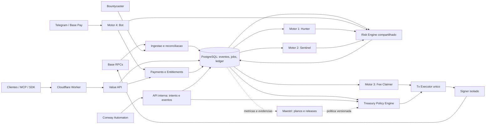
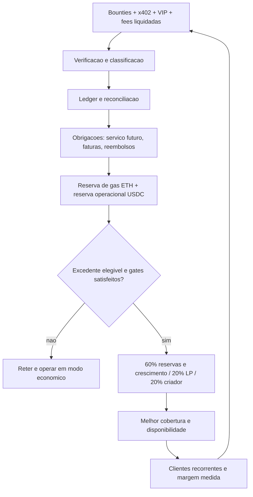

# Arquitetura Mestre Unificada — Ecossistema Automaton

**Autor:** Astra · **Data:** 26/09/2026 · **Versão:** 1.0

**Natureza:** projeto arquitetural e plano de implantação. As regras e componentes identificados como propostos ainda não foram ativados. Esta entrega não executa transferências, claims, swaps, deploys nem mudanças nos serviços.

## 1. Decisão executiva

Construir um sistema operacional de receita em torno de um **núcleo transacional compartilhado**, com quatro motores especializados, uma única política financeira e um único executor de transações. A Value API, o MCP e o Telegram são canais comerciais desse núcleo; o Conway Automaton planeja e opera dentro de permissões; o Canvas do Maestri governa mudanças e apresenta evidências.

**Fluxo principal:** observar → normalizar → persistir → analisar → vender/entregar → comprovar liquidação → reconciliar → financiar operação → reinvestir/distribuir excedente.

“100% autônomo” significa executar continuamente operações previamente autorizadas, recuperar falhas previsíveis e interromper gastos quando os limites forem atingidos. Não significa garantir demanda, recompensas de terceiros, lucro, disponibilidade permanente de fornecedores ou permitir que o agente amplie sozinho seus poderes. O sistema deverá operar sem o computador do Marcelo e sem o Canvas aberto. Novos destinatários, contratos, limites e versões do executor pertencem à governança.

**Escolha inicial:** VPS com containers separados e PostgreSQL como estado transacional; fila durável no próprio PostgreSQL; cache local reconstruível. Redis é uma evolução condicionada a medição, não requisito de partida. O custo do banco deve entrar no orçamento antes da migração. O SQLite do Conway continua privado ao runtime; integra-se por API/eventos, sem compartilhar seu arquivo entre processos ou hosts.

**Prioridade comercial:** consolidar Sentinel/API + VIP como duas interfaces do mesmo produto; usar toolkit/conformance como aquisição e verificação de integração; tratar bounties como receita eventual e fees como recuperação de valores já devidos. Não abrir posições LP apenas para dar trabalho ao Fee Claimer.

## 2. Estado verificado e limites da evidência

### 2.1 Identidade e fotografia externa

| Item | Resultado observado em 26/09/2026 |
|---|---|
| Rede | Base Mainnet, `8453` / `eip155:8453`; RPC retornou `0x2105` |
| Carteira operacional/recebedora | `0x71DEAc098914A009E3720524642A6bE6F65EE528` |
| Criador, destino solicitado | `0xA1f0A4f9ecCAA21914aBE477ab913F33C68D29fb`; propriedade não verificada nesta entrega |
| ERC-8004 | `ownerOf(95791)` no registro `0x8004A169FB4a3325136EB29fA0ceB6D2e539a432` retornou a carteira operacional |
| Saldo no bloco consultado | `2062108037719026 wei` = **0,002062108037719026 ETH**; `3589346` unidades = **3,589346 USDC** |
| Bloco da consulta | `0x316d261`, tag `finalized`; hash `0x1689fc4dd22271c8c12c40d9e09fc937053d7123359b17fb1c0e748503008e87` |
| Força da verificação | Uma resposta de `mainnet.base.org`, iniciada às **17:47:48 UTC**; não houve quórum de três provedores |
| VPS `/health` | HTTP **200**, versão declarada **0.9.0** |
| Worker `/health` | HTTP **530**, página Cloudflare **1016 Origin DNS error**, referindo túnel `pound-include-hanging-clone.trycloudflare.com` |
| VPS `/v2/sentinel/status` | HTTP **404**; as rotas existem no código local |
| RPC Llama | `https://base.llamarpc.com`: HTTP **525** na sondagem |
| RPC 1RPC | `https://public.1rpc.io/base`: HTTP **429** na sondagem |

Saldo é patrimônio momentâneo, não faturamento. A titularidade do NFT confirma identidade, não qualidade das análises nem receita. ERC-8004 não liquida pagamentos e não converte uma assinatura EIP-191 em auditoria independente. [S1]

### 2.2 Código local, testes e Canvas

Snapshots de referência: Value API `95656287957be66c39b929528218e65ffddf06b0`; Automaton `d8f816881fd24b6f5e3d616e59edec387a447667`. A inspeção leu a árvore de trabalho, que pode conter alterações ainda não commitadas e trabalho concorrente; esses hashes não são atestação de uma release completa.

| Componente | Evidência local | Implicação arquitetural |
|---|---|---|
| Value API | `package.json` 2.2.0, health público 0.9.0; vários adaptadores de pagamento | Criar manifesto único com commit, image digest, schema e policy version; distinguir versão do pacote e API |
| Bounty Hunter | `hunter-daemon.js:70–101,148–186`: análise estática, assinatura opcional EIP-191 e envio via Neynar condicionado | Produção de relatório/submissão não equivale a aceite nem claim automático de USDC |
| Sentinel | `pool-watcher.js`: polling padrão 4 s, quatro fontes incluindo Uniswap v4/Slipstream, cache `Map`, snapshot JSON, salto com registro de gap | Persistir eventos/cache, reorgs e backfill; não prometer auditoria ponta a ponta em 200 ms |
| Sentinel HTTP | `sentinel-routes.js`: snapshot por mtime, SSE de 15 min, teto local de 50 streams; `server.js:896–909` verifica `ok` | `ok` pode coexistir com `live=false`; bloquear nova cobrança de feed desatualizado |
| Fee Claimer | `claim-daemon.js:25–30,104–157`: dry-run padrão, thresholds por token, envio com um RPC | Não há orçamento global, coordenação de nonce ou cálculo completo de retorno líquido; migrar execução ao Tx Executor |
| Telegram | `bot.js:359–383`: `/claim` libera VIP por `receipt.status === 0x1` | P0: verificar token, destinatário, valor, vínculo ao pedido, finality e replay antes de ativar passe |
| Orquestrador | `autonomous-orchestrator.js:15–19,62–72`: supervisiona hunter, sentinel e claimer, com backoff | Bot, API, runtime, ledger e treasury precisam de supervisão explícita |
| Estado | `services/lib/store.js:5–18`: fallback silencioso de leitura e fallback de escrita direta | Não usar JSON como autoridade financeira; corrupção não pode virar estado vazio e liberar replays |
| Docker | Dockerfile termina em `node server.js`; `.dockerignore` tem exclusões limitadas | Build atual não comprova inicialização dos daemons; usar cópia explícita de fontes e secrets fora da imagem |
| Cloudflare | `src/index.js` prioriza origem em KV sobre `BACKEND_ORIGIN` | A resposta pública é compatível com override antigo; configuração efetiva precisa ser auditada antes de atribuir causa definitiva |
| Conway | `src/agent/policy-engine.ts`, `policy-rules/financial.ts`, `spend-tracker.ts`, `state/database.ts` | Reaproveitar intenção de limites, mas não presumir que os daemons externos estejam submetidos a eles |
| Oráculo | `oracle-real.js` contém leituras Uniswap e Chainlink | Não reutilizar o diagnóstico histórico de oráculo sintético como fato atual; ainda exigir frescor/bloco/proveniência e validação específica |
| Pagamento | `server.js` contém caminhos de liquidação e fallback `queued` | Autorização ou saldo suficiente não é liquidação; eliminar concessão final de serviço em estado apenas enfileirado |

Foram executados **22 testes locais, 22 aprovados, 0 falhas**, em `services/test/{bounty-hunter,pool-sentinel,fee-claimer,orchestrator}.test.js`. Cobrem mocks, persistência de snapshots, assinatura de teste, SSE e reinício de processos. Não comprovam checkout real do bot, quórum, implantação, recuperação de desastre ou lucro.

Maestri reconectado após diagnóstico de pipe obsoleto: `You: Astra`; agentes conectados: **Antigravity** e **Automaton**. Claude consta nas notas como executor, mas não apareceu conectado diretamente a Astra. Foram lidas `automaton-board`, `Hub de Integracoes e Instrucoes` e `Diario do Automaton`. Há divergências de versões, contagem de tools (14/15), saldos e status nessas notas. O Diário registra pagamentos de carteiras de teste e aporte confundidos com “EXTERNAL”; isso exige reconciliação antes de declarar clientes pagantes. Não foi feita nova auditoria completa de cada transferência histórica, Smithery ou atividade do bot.

## 3. Arquitetura lógica e fronteiras de confiança



1. **Plano de dados:** ingestão, análise, catálogo, API, MCP e Bot. Não tem chave da tesouraria.
2. **Plano financeiro:** invoices, liquidação, ledger, orçamento, intents e signer. O único componente que transmite operações da carteira é o executor autorizado.
3. **Plano de controle:** releases, políticas, incidentes e indicadores. Uma nota ou resposta de LLM nunca vira calldata diretamente.
4. **Fronteira externa:** textos de bounties, metadados de tokens, respostas RPC, prompts MCP e mensagens Telegram são dados não confiáveis. Validar schema/tamanho; nenhuma instrução embutida pode alterar política, iniciar shell ou obter secrets.

O runtime conserva memória/raciocínio em seu SQLite; o núcleo registra compromissos e resultados comerciais em PostgreSQL. Não criar dois ledgers concorrentes nem permitir acesso SQL de escrita do LLM ao financeiro. Ferramentas do runtime chamam APIs tipadas com identidade de serviço e escopo.

## 4. Pipeline de dados e estado unificado

### 4.1 Contrato de evento

```json
{
  "schemaVersion": 1,
  "eventId": "identificador-estavel",
  "type": "pool.observed",
  "source": "base.uniswap-v3",
  "chainId": 8453,
  "blockNumber": "numero-decimal",
  "blockHash": "0x...",
  "txHash": "0x...",
  "logIndex": 0,
  "observedAt": "UTC-ISO8601",
  "finality": "unsafe",
  "correlationId": "job-ou-request-id",
  "producerVersion": "commit",
  "payloadHash": "sha256-do-payload-canonico",
  "payload": {}
}
```

Eventos off-chain usam `chainId/blockNumber/blockHash/txHash/logIndex = null`, `sourceId` e `sourceRevision`. Eventos de bounty têm chave `source + bountyId + revision`; atualização ou correção da recompensa precisa ser reavaliada. Endereços persistidos em lowercase, checksum na apresentação; valores monetários em inteiros/strings decimais, nunca `float`. USDC nativo da Base: `0x833589fCD6eDb6E08f4c7C32D4f71b54bdA02913`, 6 casas; ETH, 18.

### 4.2 Ingestão e processamento

1. Watcher consulta logs por intervalos pequenos e adaptativos; WebSocket pode reduzir latência, mas polling/backfill mantém a correção. Identificar fonte por chain, factory/manager e assinatura de evento. Uniswap v4 usa `poolId` bytes32, não endereço de pool.
2. Inserir logs brutos, jobs derivados e checkpoint na **mesma transação de banco**. Checkpoint representa ingestão persistida, não conclusão de análise. Não avançar sobre intervalo não salvo.
3. Workers obtêm jobs por `FOR UPDATE SKIP LOCKED`, lease e tentativas limitadas. Lease expirado recoloca job em fila; heartbeat não mantém trabalho morto indefinidamente.
4. Após análise, gravar resultado e evento de saída na mesma transação. Outbox é entregue pelo menos uma vez; inbox com `UNIQUE(consumer,event_id)` e efeitos idempotentes impede duplicação lógica. Não prometer exactly-once entre banco, blockchain e serviços externos.
5. Timeouts/retries com jitter e budget; erro de validação vai para rejeição definitiva, falha transitória para retry, esgotamento para dead-letter com evidência. Políticas distintas por tipo de job.
6. Redis/pubsub, se adotado depois, apenas acelera notificações. Reprocessamento e replay dependem do banco. Arquivos JSON atuais tornam-se exports de compatibilidade de um único writer.

### 4.3 Modelo mínimo de persistência

| Tabela | Chave/invariante | Dono da escrita |
|---|---|---|
| `chain_blocks` | `(chain_id, block_hash)`; número, parent, canonical, finality | Chain Reconciler |
| `chain_events` | `(chain_id, block_hash, tx_hash, log_index)`; nunca apagar evidência órfã | Ingestor |
| `checkpoints` | `(source, chain_id)` + bloco/hash; update atômico | Ingestor |
| `jobs`, `job_attempts` | `dedupe_key` único; lease, deadline, custo reservado | Scheduler/workers |
| `outbox`, `consumer_inbox` | ID único e consumo transacional | Núcleo |
| `risk_artifacts` | chain, endereço, código, implementação, versão, bloco de estado | Risk Engine |
| `bounties`, `submissions` | bounty/revision; hash relatório; ID remoto; estado | Hunter |
| `invoices`, `payment_attempts` | invoice/order único; requisitos imutáveis/versionados | Payments |
| `payment_receipts` | chain/tx/log único; nonce de autorização único por domínio/payer | Reconciler |
| `entitlements`, `deliveries` | benefício único por invoice; entrega retomável | Payments/API/Bot |
| `journal_entries`, `journal_lines` | débitos = créditos por ativo; reversões explícitas | Ledger |
| `budget_reservations` | reserva única por intent; consumida/liberada após reconciliação | Treasury |
| `tx_intents`, `tx_attempts` | intent ID único; chain/signer/nonce único por intenção, replacements associados | Tx Executor |
| `policies`, `release_manifest`, `incidents` | versão, hash, autor, ativação, rollback | Governança/controlador |

Bloqueio financeiro e reserva de orçamento acontecem numa transação SERIALIZABLE ou por lock explícito da conta. API, Hunter e Bot nunca fazem `check balance` seguido de gasto sem reserva: duas decisões simultâneas poderiam comprometer o mesmo USDC.

### 4.4 Reorg, finality e recuperação de gaps

Manter `unsafe → safe → finalized`; são níveis de segurança da Base, não sinônimos de “uma confirmação”. Quórum de provedores também não substitui finality. [S3]

- Comparar hash/parent em cada avanço. Divergência marca eventos/risks afetados como `orphaned`, cria reversões contábeis quando necessárias e emite `pool.retracted`/`risk.invalidated` para assinantes.
- Recomeçar no último ancestral comum e reconstruir projeções. Se não for possível localizar ancestral no histórico mantido, pausar escritas financeiras e reprocessar desde checkpoint finalizado conhecido.
- Head provisório serve descoberta rápida com rótulo explícito; receitas provisórias não financiam distribuição. Considerar `safe` para acesso barato conforme teto de exposição, e `finalized` para excedente distribuível.
- O salto atual após 1.500 blocos precisa virar job de backfill: cobertura incompleta aparece no status, incluindo intervalo exato. Contratar histórico RPC quando necessário; não inferir ausência de pools durante gap.
- Replay requer retenção de eventos brutos e versões de análise. Prazo proposto: 30 dias online; arquivo comprimido por 180 dias; registros financeiros/políticas conservados por prazo definido com Marcelo. Não descartar registros de replay enquanto benefícios ou obrigações vinculados estiverem ativos.

### 4.5 Cache de risco compartilhado

Dividir análise estática de observação dinâmica. Artefato estático: `chainId/address/codeHash/implementationHash/analyzerVersion`. Observação dinâmica: artefato + `blockHash` + inputs de simulação, incluindo caller, valor, calldata, pool e hooks. Mudança de proxy/admin/implementação invalida derivativos; checks dinâmicos têm TTL curto e revalidação no bloco usado para assinar uma transação.

Hunter, Sentinel, API e Bot chamam o mesmo `RiskService`. Deduplicar scans simultâneos, limitar concorrência por cliente e realizar cache negativo curto para erros. A API inclui `method`, `limitations`, `blockNumber`, `blockHash`, `dataAgeSec`, `coverage`, `analyzerVersion` e `confidence`. Resultado `unknown`/erro nunca equivale a risco zero.

O scanner atual é estático: não comprova possibilidade de venda, taxa efetiva, ausência de honeypot, segurança de proxy/hook ou comportamento futuro. Para sinais dinâmicos, agregar simulação isolada de buy/sell em fork, por caller/rota e bloco; contratos sem cobertura permanecem `unknown`. Os dados do pool são distintos dos riscos de cada token e dos hooks v4. Cotações de tesouraria usam fonte independente e fresca; um spot de pool novo não pode determinar valor de saque.

**Meta proposta**, sujeita a benchmark: leitura de cache p95 <200 ms; publicação após log ingerido p95 <5 s; análise fria tem latência medida separadamente. O polling atual de 4 s já impede prometer descoberta/auditoria ponta a ponta <200 ms. Medir p50/p95/p99, misses, erro RPC e fila, não apenas média de scan.

## 5. Contrato operacional dos quatro motores

| Motor | Entrada | Saída | Condição de receita | Condição de parada |
|---|---|---|---|---|
| Hunter | Bounty normalizada, chain validada, escopo técnico permitido | Relatório reproduzível + submissão idempotente | Recompensa aceita e recebida; escrow somente quando integração conhecida existir | Custo esperado > orçamento, escopo/chain ambíguo, prazo vencido, conteúdo inseguro |
| Sentinel | Pools/txs canônicos, RiskService | Feed e snapshots versionados | Entrega coberta por pagamento/entitlement | Feed velho, gaps incompatíveis com oferta, sem quórum para claims de certeza |
| Fee Claimer | Posições/direitos pertencentes à carteira | Intent de collect/claim; conciliação | Fees efetivamente recebidas e avaliáveis, sem contar principal retirado | Sem direito econômico, retorno líquido baixo, contrato/ABI não permitido |
| Bot | Mensagens Telegram validadas + invoice | Scan, simulate, passe VIP | Pagamento verificado e benefício associado ao usuário | Replay, indisponibilidade de pagamento, abuso ou budget de inferência/RPC |

### 5.1 Hunter: prova e claim não são sinônimos

Estados: `discovered → eligible → solving → ready → submitting → submitted → accepted → payable → paid`; saídas `rejected/expired/needs_review/submission_unknown`.

O código atual produz relatórios e, quando configurado, replies Farcaster. Não existe no fluxo inspecionado um escrow universal ou pagamento garantido pelo Bountycaster. Adaptador de payout deve conhecer contrato, ABI, chain, condição de claim e autorizador. Sem isso, o Hunter monitora recebimento e mantém `submitted/accepted`, sem inventar saldo a receber realizável.

Persistir submissão antes do envio; timeout vira `submission_unknown`, consultar remote ID/cast antes de reenviar. Assinatura inclui domínio, versão do relatório, identidade completa ERC-8004 (chain + registry + ID), bounty, inputs, bloco e hash. Verificar vínculo do signer ao owner/agentWallet/delegação. Relatório assinado atesta autoria, não validação externa. Revisão/execução de código externo só em sandbox efêmero, sem chaves, sem rede interna, com CPU/memória/tempo e egress limitados.

Priorizar bounties com remuneração e aceite claros. `EV = probabilidade_empirica_de_aceite × recompensa_liquida − custo_total`; até existir histórico, usar teto pequeno de exploração e registrar hipótese. Não investir o valor anunciado antes de receber.

### 5.2 Sentinel: stream pago retomável

`/v2/sentinel/status` informa freshness, atraso em blocos, cobertura, gaps e versão. Se não cumprir contrato de frescor, recusar nova cobrança com 503; snapshot histórico só pode ser vendido como histórico explicitamente solicitado.

`/latest` devolve snapshot com cursor. `/stream` vende uma janela temporal/cota, não “conexão TCP”: liquidar uma vez, criar entitlement, emitir cursor SSE estável `id`, aceitar `Last-Event-ID` e reabrir até expirar sem nova cobrança. O browser pode usar cliente que transmita credencial em header; evitar bearer sensível em URL/log. Eventos `pool`, `risk.updated`, `retracted`, `gap`, `heartbeat`, `expired`. Replays mantêm IDs; cliente deduplica.

Capacidade reservada antes da cobrança, liberada se liquidação falhar. Limites globais por conta/entitlement e nó; backpressure fecha cliente lento com possibilidade de retomada. SSE não é cacheado pelo Worker; heartbeat e testes de reconnect através do proxy são requisitos de release. Adotar inicialmente os preços locais como catálogo versionado, não como prova de margem: latest 0,001 USDC, stream 0,01 USDC/15 min.

### 5.3 Fee Claimer: recuperar, não especular

Confirmar posição, proprietário e ABI por protocolo/versão. Uniswap v3 coleta por posição NFT; Clanker exige direito no fee locker; Aerodrome v2, Slipstream e gauges têm semânticas diferentes e adaptadores próprios. Suporte local a um deles não implica suporte aos demais. Collect v3 é uma operação de posição existente. [S5]

Quarentenar tokens recebidos sem preço/rota autorizada. Taxa recebida em WETH/AERO não é USDC liquidado. Separar receitas de fees de retirada de principal e de P&L da posição. Simular no bloco recente, comparar benefício conservador ao custo total e enviar intent. Reavaliar após cada claim e registrar os logs efetivos; não registrar `claimed` só porque foi transmitida uma transação.

### 5.4 Bot e Base Pay

O fluxo `/pass` inspecionado é transferência manual + `/claim`; não há evidência suficiente para chamar isso de checkout Base Pay integrado. Arquitetura proposta: `/pass` cria invoice e link de checkout HTTPS; cliente confirma pagamento; backend identifica a transferência e ativa o passe. O frontend é UX, não autoridade de settlement.

Validar `chainId`, endereço do contrato USDC nativo, receipt `status=1`, log `Transfer`, destinatário, valor mínimo/exato da invoice, bloco canônico e regra de finality. Vincular wallet ao pedido/chat por assinatura de desafio ou identificador autenticado do checkout; não aceitar hash público solto como prova de propriedade. Um pagamento só pode adquirir o benefício contratado uma vez: unicidade global `(chain, tx, logIndex)`, também entre Bot e API. Renovação parte de `max(agora, expiresAt)`; reenvio retorna o mesmo resultado.

Gravar pagamento, entitlement e obrigação de entrega numa transação do banco; mensagem Telegram é outbox, reentregável sem estender passe de novo. `update_id` deduplica mensagens. Bot token fica somente no container do bot. Trocar “ilimitado” por limites operacionais transparentes antes de publicar nova oferta; VIP nunca significa CPU/RPC/inferência ilimitados. Dados pessoais mínimos, retenção definida e logs sem token/chat completo quando desnecessário.

## 6. Payments, liquidação e ledger único

### 6.1 x402 e interoperabilidade

Fixar versão de protocolo e SDK; implementar adapter central usado por todas as rotas e MCP. No transporte v2 usar `PAYMENT-REQUIRED`, `PAYMENT-SIGNATURE` e `PAYMENT-RESPONSE`, com requisitos de rede, ativo, recebedor e montante. Manter txHash legado em interface identificada e testada, sem apresentá-lo como todo o protocolo. [S2]

Separar estados `quoted → authorized → settlement_pending → settled → delivered`; `failed/expired/refund_due/refunded` são explícitos. Verificação de assinatura, saldo ou fila não autoriza classificar receita como recebida. Preparar dados/capacidade antes de liquidar; liberar o conteúdo premium após confirmação de settlement. Se a entrega falhar, preservar entitlement retomável ou crédito/reembolso rastreável conforme política publicada. Não depender de uma suposta transação distribuída entre chain e banco.

Ao cair entre settlement e commit, reconciliador consulta nonce/tx/log e recupera a entrega; não liquida novamente uma autorização nova automaticamente. Concorrência entre réplicas exige reserva persistente e UNIQUE, não `Set` em memória. Requisitos aceitos são comparados ao catálogo e à invoice; não confiar nos valores enviados pelo comprador. Workers preservam headers de pagamento e expõem os headers necessários por CORS.

### 6.2 Contabilidade

Cada entrada tem `source`, `economic_class`, payer, invoice/job/position, chain/tx/log, amount e estado de finality. Classes: `customer_revenue`, `bounty_reward`, `lp_fee`, `capital_injection`, `internal_test`, `self_transfer`, `unattributed`, `refund`. Contrapartida própria nunca vira cliente apenas porque usa outra carteira. Um registro de carteiras controladas/teste é obrigatório; o que não se consegue atribuir fica `unattributed` e fora do lucro distribuível.

Exemplos de lançamentos, sempre por ativo:

- Liquidação VIP: débito em caixa USDC / crédito em receita diferida; reconhecer a receita durante os dias de serviço, conservando custo futuro de atendimento.
- Feed entregue: débito em caixa / crédito em receita de serviço (ou passagem por conta de liquidação pendente até confirmação).
- Aporte: débito em caixa / crédito em capital; não faturamento.
- Claim de fee: débito no ativo recebido / crédito em receita de fee; conversão posterior para USDC registra custo/slippage separadamente.
- Swap gás: reclassificação de caixa entre ativos mais despesa de execução; não receita.
- Payout ao criador: distribuição de resultado, não custo operacional do produto.

Reconciliar continuamente e fechar diariamente: saldo por ativo no bloco escolhido = saldo inicial + entradas − saídas. Diferença inexplicada bloqueia novos gastos e distribuições; entradas podem continuar em quarentena. Contadores de chamadas e receita estimada são métricas auxiliares. Auto-compra de serviço só é teste e tem budget próprio.

## 7. Treasury Loop e auto-sustentação

### 7.1 Cascata financeira



**Todos os percentuais e limites desta seção são proposta v1; não são configuração vigente nem autorização de movimentação.** O perfil inicial é `observe_only`. Políticas numéricas ativadas precisam de versão, proprietário e evidência de aprovação; depois, operações dentro delas dispensam intervenção por transação.

Definições para um fechamento, sem dupla contagem:

- `B`: caixa USDC reconciliado e finalizado, disponível; exclui tokens sem liquidez, LP e saldos já bloqueados.
- `L`: obrigações ainda não pagas, créditos/reembolsos, provisões aplicáveis e custo contratado de prestar VIP ainda vigente.
- `C_day`: custo diário prospectivo total da operação, incluindo VPS, RPC, backup, inferência, facilitador, tráfego e observabilidade; usar maior entre orçamento contratado e consumo recente relevante. Sem custo confirmado, não habilitar distribuição.
- `O_target = 60 × C_day`: reserva de 60 dias futuros, sem duplicar faturas vencidas/vinculadas já em `L`. `O_floor = 30 × C_day` aciona conservação.
- `G_topup`: USDC necessário para completar a reserva ETH pela cotação conservadora, já com execução/slippage.
- `P_pending`: lucro realizado acumulado elegível e ainda não alocado, após custos, perdas e provisões. Aportes não entram.
- `E = max(0, min(B − L − O_target − G_topup − outras_reservas, P_pending))`.

No fechamento semanal, somente se não há incidente/reconciliação pendente e a margem operacional foi positiva por 30 dias, alocar `E`: **60%** para reserva adicional/crescimento, **20%** para orçamento LP e **20%** para distribuição ao criador. Alocar não é necessariamente transferir; registrar compromissos únicos. Parcela LP bloqueada volta à reserva, não aumenta o payout. Resultado já alocado não pode ser reapresentado como `P_pending` no fechamento seguinte. A soma de todas as reservas mais valores gastáveis nunca excede o caixa disponível.

### 7.2 Gás ETH na Base

Estimar custo total de cada intent: execução L2, componente de dados L1 e demais componentes vigentes da Base, usando estimador compatível com a rede. Não usar apenas `gasLimit × gasPrice` como custo completo.

Proposta: `G_floor = max(0,0002 ETH, 3 × gas_p95_diario_critico + gas_de_recuperacao)`; `G_target = max(0,0005 ETH, 7 × gas_p95_diario_critico + gas_de_recuperacao)`. Valores absolutos são parâmetros iniciais, não custo medido. Prioridades: recuperar pagamento/nonce → claim economicamente positivo → recompor gás → trabalho experimental → LP → distribuição.

Quando ETH < floor, recompor até target usando rota USDC→WETH e unwrap, ou USDC→ETH explicitamente permitida. Histerese: no máximo uma tentativa de recomposição por hora; saída não pode atravessar reservas operacionais; quote fresca, deadline, `minOut`, price impact e slippage limitados. Falta de quote válida implica não executar.

**Bootstrap:** trocar USDC exige gás ou patrocínio previamente funcional. ETH zero não se resolve com loop de swap que também precisa de ETH. Reservar gás de recuperação e prever aporte inicial explícito ou paymaster contratado; sem ambos, entrar em `NO_GAS`, manter leituras e parar transações.

### 7.3 Infraestrutura e capital de giro

Adaptador `InfrastructureBilling` mantém fornecedor, invoice, vencimento, moeda, forma de pagamento, limite e comprovante. Auto-renovar só serviços/planos aprovados, com credencial restrita e teto. Se VPS/RPC cobram em fiat/cartão e não oferecem API/USDC, usar saldo pré-pago/autopay previamente configurado pelo titular e reconciliar consumo. Não afirmar pagamento autônomo de VPS apenas por ter USDC na Base.

Capital de giro necessário para habilitar o plano: `O_target + L + custo de G_target + contingência de migração`, usando custos reais. O saldo observado de 3,589346 USDC não permite concluir suficiência sem conhecer faturas e gastos de inferência. Caso a migração PostgreSQL não caiba no orçamento, manter primeiro uma fase controlada de **um único processo escritor** com SQLite WAL, fila e journal transacionais, sem múltiplos containers escritores; migrar ao alvo antes de escalar. JSON continua inadequado ao financeiro.

### 7.4 Fees, recomposição LP e recompra

Só claim quando `valor_conservador_recebivel >= 5 × custo_total_estimado` e lucro líquido > mínimo configurado; consolidar claims quando for suportado e seguro. A regra local de 1 USDC/0,0003 WETH é threshold, não teste completo de viabilidade.

LP fica desabilitado até haver excedente elegível, posições/contratos allowlisted, dados de preço confiáveis e acompanhamento de P&L. Proposta de teto: exposição LP total ≤10% do patrimônio líquido reconciliado, sem utilizar reserva de operação ou gás; medir valor de saída conservador, impermanent loss, risco de contrato e concentração. A parcela de 20% de `E` é ainda limitada por esse teto. Apenas pares/routers aprovados; não comprar tokens novos detectados pelo Sentinel automaticamente.

“Recompra” de token próprio fica em **0**: o briefing não define token, contrato, mandato ou objetivo econômico. Recompor liquidez significa aumentar posição já aprovada com excedente, dentro do limite, não lançar token nem fabricar volume. Saída de emergência de LP também passa pelo executor e orçamento; não assumir liquidez instantânea em incidente.

### 7.5 Repasse ao criador e unit economics

Destino fixo solicitado: `0xA1f0A4f9ecCAA21914aBE477ab913F33C68D29fb`. Antes da primeira ativação, validar endereço/rede e controle do destinatário; assinar política que fixa esse destino. Proposta: fechamento semanal, acumular até `max(5 USDC, 10 × custo de envio)` e submeter um intent por período. Nunca transferir “saldo que sobrou” sem fechar ledger. Nenhum desses repasses foi efetuado nesta entrega.

Por produto medir `margem_unitaria = preco_liquido − RPC − inferencia − settlement − trafego − suporte/reembolso incremental`. Custos fixos são cobertos pela soma de margens, não pela contagem de tools. `calls_break_even = custos_fixos / margem_unitaria` só se margem >0. Para stream medir custo por conexão-minuto; para VIP, distribuição de uso por assinante; para bounty, custo por tentativa e taxa de aceite. Não prometer sustentabilidade com taxas LP ainda não existentes.

## 8. Tx Executor, signer e circuit breakers

Todos os motores enviam `TxIntent{intentId, policyVersion, chainId, operation, target, decodedArgs, value, maxCost, deadline, evidenceHash}`. O executor reconstrói calldata de ABI permitida; recusa calldata arbitrária proveniente do LLM. O signer tem acesso mínimo, não pode ser acessado pela API pública ou pelo Bot; preferir assinatura em serviço separado com limites próprios. Chave de assinatura de relatórios separada da chave financeira, com vínculo de identidade documentado.

Estados: `proposed → policy_checked → budget_reserved → simulated → nonce_reserved → signed → broadcast → mined → safe → finalized`; saídas `rejected/expired/reverted/replaced/unknown`. Persistir hash e transação assinada protegida antes do envio; crash após broadcast pode ser reconciliado sem novo nonce. Lease/fencing impede dois executores ativos; row lock/unique protege `(chain, signer, nonce)`. Nonce local confrontado com pending e histórico RPC; discrepância para e investiga, não “incrementa até funcionar”.

Reenvio de mesma operação: mesmos bytes e hash em RPC alternativo. Replacement: mesmo nonce, mesma intenção e aumento de fee limitado; no máximo duas substituições, custo agregado reservado. Timeout não prova fracasso: consultar hash/nonce em mais de um provedor antes de cancelar/repetir. Nenhum motor usa `wallet.sendTransaction` diretamente após a migração.

| Circuit breaker proposto | Gatilho inicial | Resposta | Retorno |
|---|---|---|---|
| Custo por intent | >0,10 USDC equivalente, salvo classe crítica com teto próprio aprovado | Rejeitar/adiar; não elevar sozinho | Nova quote dentro da política |
| Gasto diário de gás | >min(1 USDC, 1% do NAV líquido conservador no início do dia) | Parar ações não críticas; fila preservada | Próxima janela + reconciliação; reserva crítica separada |
| Reverts | 3 para mesmo target/op em 10 min | Quarentenar alvo por 1 h | Simulação e diagnóstico aprovados |
| Nonce/assinatura | Colisão, signer inesperado, policy hash divergente | Parar todas as saídas | Revisão/rotação e reconciliação |
| RPC | Sem 2 provedores saudáveis em leitura crítica | Read-only financeiro | Quórum recuperado e checkpoint validado |
| Gás/quote | Spike >3× mediana recente, stale ou spread >limite | Adiar não críticos | Dados frescos, limites mantidos |
| Reinícios | >5 por 10 min por serviço | Abrir circuito, retirar readiness | Diagnóstico; não reiniciar eternamente |
| Recursos | Timeout por job, CPU/memória/IO excedidos | Encerrar job/container isolado, registrar falha | Retry limitado ou dead-letter |
| Ledger/DB | Corrupção, disco >85%, diferença de saldo | Pausar saídas e cobrança sem persistência | Restore/reconciliação concluídos |
| Perda patrimonial | >5%/dia ajustada por aportes, saques e obrigações | Congelar LP e expansão | Revisão de risco |

São valores iniciais conservadores para calibração, não uma liberação automática. Definir caps separados para gas de settlement, refunds e recuperação para não usar toda a reserva com claims. Um serviço não pode contornar limite trocando de carteira/rota.

**Reentrância:** lock de daemon não protege smart contract. Se um vault/executor on-chain próprio for introduzido, exigir controle de acesso, checks-effects-interactions, `nonReentrant`, limites e testes de callbacks maliciosos; pausable e ausência de `delegatecall` arbitrário. Para EOA, os controles relevantes são seleção de contratos, simulação, allowances exatas/revogáveis e limitação do montante exposto. Evitar approvals ilimitados. Segurança contra reentrância não pode ser declarada por ter um supervisor Node.

## 9. RPC: quórum de leitura e tolerância a falhas

Pools configuráveis: Base.org, LlamaRPC, 1RPC, além de provedor contratado/nó próprio quando viável. Os três nomes não garantem independência de infraestrutura; 1RPC é relay e pode compartilhar upstream. No bootstrap verificar chain ID, genesis/bloco histórico conhecido, suporte às tags, limites de logs, latência e quota. Não incluir segredo/API key nos logs.

**Algoritmo para leitura crítica:**

1. Consultar heads e saúde em paralelo com timeout (proposta: 2 s por leitura interativa, 10 s por backfill).
2. Escolher altura comum compatível com a finalidade requerida. Buscar o bloco dessa mesma altura em todos os provedores; exigir dois hashes iguais de provedores elegíveis. Não comparar `latest` de alturas diferentes.
3. Executar `eth_call`, saldo e receipt no bloco fixado; usar block hash quando o método/provider suportar, ou verificar hash antes/depois de chamadas por número. Comparar resultado normalizado, logs ordenados e receipt canônico.
4. Retirar provedor atrasado/divergente do voto, registrar causa e testar em half-open após cooldown. 429 aplica Retry-After/backoff; JSON-RPC revert determinístico não é falha de transporte, mas divergência entre provedores exige investigação.
5. Sem quórum: pode manter feed provisório identificado e dados cacheados com idade; não confirmar novas receitas, liberar passe definitivo nem assinar gasto/distribuição. Uma maioria RPC é checagem de consistência, não consenso de blockchain nem defesa absoluta contra conluio.

Broadcast usa um provedor e consulta o mesmo hash nos demais; não gera uma transação por RPC. `safe/finalized` e finality L1 orientam promoção do estado. A sondagem desta entrega deixou só Base.org utilizável: **a política proposta de dois votos ainda não seria satisfeita**. Corrigir conectividade/quotas ou contratar endpoints antes de habilitar o fluxo financeiro sob essa regra. O endpoint público documentado de 1RPC é `https://public.1rpc.io/base`; o antigo alias não deve ser presumido. [S4]

## 10. Topologia de implantação

| Local | Responsabilidade | Estado/secrets | Limite |
|---|---|---|---|
| Computador Marcelo | Desenvolvimento, testes, Canvas, auditoria e planos | Checkout e credenciais de desenvolvimento | Desligar não interrompe receita ou cron financeiro |
| Cloudflare Worker | Entrada HTTPS, roteamento, limites de borda, catálogo/cache público, passagem SSE/MCP | Secret de origem; KV para configuração eventual | Sem chave financeira, ledger, nonces ou daemon contínuo |
| VPS: API | HTTP/MCP, validação, conteúdo e entitlements | DB role restrita; sem signing key | Stateless fora do DB/artifacts |
| VPS: workers | Ingestão, risk, hunter e claimer planner | Credenciais próprias mínimas | Emitir intents, não assinar |
| VPS: Bot | Long polling singleton ou webhook autenticado | Bot token; cursor persistente | Uma modalidade por release; dedupe update_id |
| VPS: Conway runtime | Planejamento, tarefas e adaptação permitida | Volume privado SQLite/memória, inferência com budget | Sem alteração livre de policy/signer/release |
| VPS: Treasury/Executor | Orçamento, conciliação, fila de tx, nonce | DB role financeira; comunicação privada com signer | Um writer lógico por carteira |
| Signer isolado | Verifica limites finais e assina | Secret montado/keystore; idealmente isolamento fora do mesmo host | Separar host posteriormente reduz comprometimento conjunto |
| PostgreSQL | Fonte de verdade comercial e transacional | Volume durável, WAL, roles, TLS/rede privada | Não expor porta pública |
| Object storage/backup externo | Relatórios imutáveis, snapshots e WAL | Criptografia e permissões write/read separadas | Backup só no disco da VPS não é DR |

**Fase inicial:** containers por serviço, mesma imagem de aplicação por digest quando possível. Docker/Easypanel supervisiona containers; `autonomous-orchestrator.js` vira supervisor interno apenas no modo transitório de workers agrupados. Não manter dois supervisores concorrentes reiniciando a mesma unidade. O alvo final remove a necessidade de `spawn` compartilhando `process.env` com todos os filhos.

Readiness verifica dependências e progresso: API viva pode não conseguir cobrar; watcher vivo pode estar sem avançar. `/health/live` só mede processo; `/health/ready` mede DB/migrations/filas e dependências da rota. Endpoint público mostra versão/cobertura sem segredos; métricas internas autenticadas.

**Origem estável:** Worker deve rotear para VPS estável e aceitar apenas origens HTTPS allowlisted/versionadas. Retirar overrides de túnel temporário por mudança controlada. Testar origem direta e edge; probe falho não deve reescrever roteamento repetidamente. Endpoints de administração restritos, autenticados e auditados. Cloudflare KV é eventualmente consistente, portanto não serve para nonces, orçamento ou exclusão mútua. [S6]

Release: build com lockfile (`npm ci` onde aplicável), versões de runtime suportadas/pinadas, SBOM e verificação de secrets; cópia explícita de fontes. Não copiar wallet JSON, chaves, `.env`, buyer wallets, estado, logs e `.maestri` para imagem. Auditar build context sem exibir conteúdo de secrets. Secrets montados em runtime; usuário não root, filesystem read-only salvo volumes, limits de CPU/RAM/PIDs e rede interna mínima.

Deploy expand/contract para schema: migração compatível, canário da API, workers por versão, smoke tests de pagamento e rollback de imagem sem apagar ledger. Manifesto conecta image digest/commit/API semver/schema/policy. Local e produção exibem essas mesmas dimensões. Assinatura de transações fica desabilitada durante migração de identidade/nonce até reconciliar.

## 11. Matriz de resiliência e recuperação

| Falha | Efeito tolerado | Resposta automática | Critério de recuperação |
|---|---|---|---|
| API reinicia | Conexões HTTP/SSE caem | Nova réplica, recuperar invoice/entitlement | Mesmo pagamento recupera acesso sem duplicação |
| Watcher reinicia | Atraso temporário | Retomar checkpoint + backfill | Zero gaps silenciosos; duplicatas deduplicadas |
| Risk worker morre | Jobs em execução atrasam | Lease expira, retry limitado | Mesmo artefato determinístico/versionado |
| RPC único cai | Menor capacidade | Circuit breaker e quórum alternativo | Dois provedores concordam no mesmo bloco |
| Todos RPCs caem | Dados ficam velhos | Suspender cobrança de live e saídas | Head/finality/nonce reconciliados |
| DB cai | Sem nova cobrança segura | API retorna 503; signer fechado | DB restaurado e invariantes conferidos |
| Cache some | Latência aumenta | Reconstituir do banco e limitar misses | Serviço responde dentro do SLO degradado |
| Facilitador cai | Settlement pendente | Manter tentativa consultável; sem liberar premium final | Receipt confirmado ou falha definitiva |
| Telegram indisponível | Mensagens atrasam | Outbox com retry; benefício permanece | Reentrega sem nova cobrança/renovação |
| Worker/origin DNS falha | Canal principal indisponível | Alerta e rollback para origem estável validada | Probe ponta a ponta e SSE/MCP passam |
| VPS perdida | Operação pausa | Restaurar imagem/DB/artefatos em host reserva | Fence host antigo; reconciliar chain antes de assinar |
| Chave comprometida | Risco de fundos/identidade | Kill switch, bloqueio de signer e plano de rotação | Nova autoridade verificada, contratos/allowances revistos |
| Canvas ou PC fora | Sem interface de governança | Runtime mantém última policy válida, envia outbox depois | Sincronização por revisão/hash sem duplicar tarefas |

Metas iniciais propostas: RTO ≤60 min para perda da VPS; RPO ≤5 min para dados não financeiros com WAL/backup externo; nenhuma duplicação financeira tolerada. O RPO não pode prometer perda zero de invoices off-chain se só existe backup a cada 5 min: para habilitar dinheiro, exige-se cópia durável de intents/invoices/entitlements antes de broadcast/entrega ou DB replicado com confirmação adequada. Em restore sem essa garantia, manter read-only até reconstruir e resolver órfãos. Custear essa proteção antes de alegar autonomia financeira.

Backups criptografados diários + WAL contínuo; restore ensaiado mensalmente e antes de ampliação de limites. Recuperação: parar signers → isolar writer antigo → restaurar → verificar schema/policy → backfill chain → reconciliar intents/nonces/receipts/entitlements → habilitar leituras → canário financeiro → abrir limites. Não ligar automaticamente o signer só porque Docker reiniciou.

## 12. Governança multiagente no Canvas

### 12.1 Matriz de responsabilidades

`A` = autoridade operacional responsável; `R` = executa; `C` = consultado; `I` = informado. Marcelo permanece autoridade sobre novos poderes financeiros, custódia, destinatários e compromissos comerciais fora da política.

| Decisão/atividade | Antigravity | Claude Code | Automaton | Astra |
|---|---|---|---|---|
| Prioridades e dependências | A/R | C | C | C |
| Implementação e migrações | A | R | I | C |
| Revisão arquitetural e de métricas | A | C | C | R |
| Evidências de testes e release candidate | A | R | C | C |
| Deploy/rollback conforme mandato vigente | A | R | C | C |
| Operação 24/7 dentro da policy | A | C | R | I |
| Ingestão, claims e cobrança permitidos | I | C | A/R | C |
| Reconciliação e prestação de contas | I | C | R | A |
| Alterar limites/destinatários/contratos | R: preparar | C | I | C: parecer; Marcelo aprova |
| Pausa automática por incidente | I | C | A/R | I |
| Retomada após incidente crítico | A | R | C | C |
| Experimentos de aquisição e preços | A | C | R dentro do mandato | R: desenho/métricas |

Claude não aprova sozinho a própria mudança financeira; Antigravity gere a release, Astra confere métricas/limites e Marcelo ratifica ampliação de autoridade. Governança não requer quatro agentes online por transação. Rotinas determinísticas da VPS executam budgets e breakers sem pedir conselho ao Canvas.

### 12.2 Notas e fontes de verdade

- **Arquitetura Unificada do Ecossistema:** resumo, diagramas, decisões, estado de implantação, próximos gates e link/hash deste documento. Astra mantém a síntese, preservando histórico de revisões.
- **automaton-board:** Antigravity mantém backlog, responsável único, dependências, release e bloqueios.
- **Hub de Integracoes e Instrucoes:** contratos públicos de endpoints/catálogo, versões e instruções; atualizar a partir do manifesto validado, não de lembranças.
- **Diario do Automaton:** runtime mantém eventos resumidos/medidos, distinguindo teste, aporte e receita externa.

Notas são projeções humanas. Código/policy versionados e ledger são fontes executáveis. Não guardar secrets, seed, tokens Telegram/RPC ou raciocínio privado nas notas. Git não recebe DB/keys. Conflito entre nota e telemetria gera item de reconciliação; um “CONCLUÍDO” não supera receipt ou probe contrário.

### 12.3 Envelope de coordenação

```json
{
  "protocol": "automaton.control.v1",
  "messageId": "uuid",
  "correlationId": "ARQ-001",
  "from": "Astra",
  "to": "Antigravity",
  "type": "PROPOSAL",
  "revision": 1,
  "expectedRevision": 0,
  "scope": "payments-and-ledger",
  "owner": "Claude Code",
  "status": "proposed",
  "artifact": "ARQUITETURA_UNIFICADA_AUTONOMA.md",
  "artifactSha256": "hash-do-arquivo",
  "evidence": [],
  "budget": {"mode": "observe_only"},
  "expiresAt": "UTC-ISO8601",
  "requires": ["G0", "G1"]
}
```

Tipos: `PROPOSAL`, `ASSIGN`, `ACK`, `RESULT`, `REVIEW`, `RELEASE`, `INCIDENT`, `POLICY_CHANGE`. Fluxo: proposta → ACK → execução → evidência → revisão → release → verificação. IDs estáveis deduplicam mensagens; ACK só confirma recebimento, não execução. `RESULT` contém paths, hash/commit, testes, limitações e rollback. Silêncio nunca aprova; deadline vencido marca `blocked`/alerta conforme contrato.

O CLI não fornece CAS de notas: usar **um escritor por seção/nota**, ler revisão antes de editar, preferir append/edit a overwrite e detectar conflito. Coordenador serializa atualizações. Outbox durável na VPS publica resumos quando o conector autorizado estiver acessível; indisponibilidade do Canvas não perde intents nem bloqueia o runtime. Assinatura de mensagens executáveis usa credencial de serviço e policy version; texto visível da nota não é credencial.

Cadência: health técnico 30 s; reconciliação incremental a cada bloco seguro/poll configurado; resumo operacional 15 min; fechamento financeiro diário; revisão de margem e gates semanal. Frequências são ajustáveis ao orçamento. Evitar atualização de nota a cada token/turno e não confundir número de turnos com resultado.

## 13. Métricas e critérios de sustentabilidade

| Pilar | Indicador | Critério proposto para ampliar autonomia |
|---|---|---|
| Receita real | USDC reconciliado de clientes externos, excluindo testes/aportes | Receipts atribuídos a pedidos e entregas |
| Retenção | Compradores recorrentes 7/30 dias e renovação VIP | Cohorts rastreáveis; quantidade de carteiras não prova pessoas distintas |
| Margem | Margem por rota, stream-minuto, VIP e bounty | Cada oferta escalada tem contribuição positiva |
| Caixa | Runway e reservas após obrigações | ≥60 dias para expansão/payout; <30 dias conserva |
| Confiabilidade | Disponibilidade, backlog, frescor, cobertura/reorg | Metas medidas 30 dias; disponibilidade inicial alvo 99,5%, não SLA já prometido |
| Integridade financeira | Replays, divergências, duplicação, drift de nonce | Zero exceções financeiras não resolvidas |
| Risco | Falsos positivos/negativos em corpus rotulado | Publicar cobertura/limitações; nenhuma garantia de token seguro |
| Hunter | Aceite, tempo de pagamento e EV realizado | Escalar só fontes com retorno demonstrado |
| LP | P&L líquido versus manter ativos, fees menos custos | Não ampliar posição que só exibe yield bruto |
| Autonomia | Operações dentro de policy, horas sem intervenção, incidentes recuperados | PC/Canvas desligados em ensaio e restore concluído |

**Sustentabilidade operacional demonstrada:** janela móvel de 30 dias com receita externa realizada cobrindo todos os custos de operação e perdas, obrigação futura financiada, reservas mantidas e sem aporte necessário para pagar o período. Isso não garante sustentabilidade futura; repetir medição mensal. Uma transação própria real prova settlement, não demanda.

Flywheel comercial: catálogo/toolkit facilita integração → primeira compra independente → evidência de utilidade e entrega → recompra/renovação → margem financia cobertura/RPC → qualidade melhora retenção. Só então distribuir resultado ou experimentar LP. Conformance mede checks executados e versão; não vender selo como auditoria financeira ou de segurança integral.

## 14. Roadmap executável e gates de aceite

Prazos são estimativas de sequência, dependentes de capacidade/custos confirmados; nenhum gate está automaticamente aprovado por este documento.

| Gate / ordem | Entrega e responsável | Evidência de aceite |
|---|---|---|
| **G0 — integridade, 0–2 dias** | Antigravity coordena; Claude corrige VIP, bloqueia premium apenas queued, estabiliza origem Worker e cria manifesto | Pagamento sem relação não libera VIP; replay concorrente negado; edge e origin corretos; Sentinel implantado ou marcado indisponível |
| **G1 — estado, 2–5 dias** | Claude implanta banco/fila/outbox e RiskService; Automaton roda shadow; Astra revisa contratos | Kill em cada fronteira não perde evento nem duplica benefício; reorg invalida dados; cache invalidável |
| **G2 — financeiro, 5–8 dias** | Claude constrói ledger/intent/signer; Astra reconcilia; Marcelo ativa mandato inicial | Todos os signers diretos removidos do caminho dos motores; orçamento atômico, nonce único, quotes e receipts auditáveis |
| **G3 — VPS autônoma, 8–10 dias** | Antigravity/Claude migram runtime e supervisão; Automaton opera | PC/Canvas desligados 24 h; probes externos, restore e falha RPC testados; infra com cobrança definida |
| **G4 — cliente real, 10–14 dias** | Astra desenha oferta/experimento; Antigravity coordena distribuição; runtime atende | Comprador independente usa cliente x402 compatível; receipt + entrega + feedback; primeiro uso não interno |
| **G5 — escala, ≥30 dias medidos** | Astra atesta métricas; Marcelo aprova ampliação de policy | Margem/retensão/reserva sustentadas; budgets calibrados; LP/payout só após gates |

Backlog de módulos propostos: `services/core/{db,outbox,jobs,reconciler}`, `services/risk`, `services/payments`, `services/treasury`, `services/tx-executor`, `services/runtime-bridge`, `services/observability`, `deploy/`, `policies/`. Estes paths descrevem a implementação futura; não foram criados por esta entrega.

**Migração incremental:** manter APIs públicas; introduzir Payments central primeiro; importar JSONs com hash e proveniência sem inventar invoices; classificar registros incompletos como não reconciliados; desativar writer antigo na virada; reconciliar saldo inicial e nonces; depois unificar cache/jobs e mover runtime. Não dual-write financeiro sem protocolo; exports legados são só leitura. Evitar reescrever o ecossistema inteiro num deploy.

## 15. Plano de validação antes de produção autônoma

1. **Eventos:** log duplicado, reorg, pool v4 com hook, proxy atualizado, gap >1.500 blocos, restart antes/depois de checkpoint, replay por versão. Validar cobertura e estados `unknown`.
2. **Pagamentos:** token/rede/destinatário/valor errados; receipt reverted/pending; replay da mesma transferência entre API e Bot; duas réplicas simultâneas; expiração de autorização; settlement confirmado com resposta HTTP perdida. Acesso e cobrança permanecem únicos.
3. **VIP:** hash público de terceiro não ativa; assinatura de vínculo e invoice; mensagens duplicadas não estendem; renovação correta; crash após pagamento recupera benefício.
4. **SSE/MCP:** handshake de cliente oficial; headers pela borda; desconexão e retomada sem pagar novamente; cliente lento; stream esgotado; freshness falso bloqueia cobrança antes de settlement.
5. **Treasury:** receitas de teste excluídas; aporte sem lucro; VIP pré-pago provisionado; saldo/quote stale; ETH zero; swap revert; ausência de posição LP; fees em token sem preço. Fechamentos repetidos não distribuem duas vezes.
6. **Executor:** crash entre assinatura e broadcast, timeout com tx minerada, replacement e nonce gap, dois writers, mudança de policy no meio, budget simultâneo. Nenhum desses casos aumenta permissões.
7. **RPC:** alturas diferentes, hash divergente, 429/525, provider malicioso e sequencer interrompido. Sem quórum não há promoção financeira.
8. **Operação:** restore externo, perda de VPS, DB sem disco, Canvas desligado, restart storm, bot token ausente, inference provider fora. Alertas contêm ação/responsável/evidência, sem secrets.

Teste econômico on-chain somente após mandato explícito de orçamento, com quantia mínima definida por rota e custo e classificação `internal_test`; comprador independente é teste comercial separado. Esta entrega rodou apenas a suíte local indicada na seção 2 e sondagens de leitura.

## 16. Decisões registradas e pendências de implantação

Decisões de projeto: núcleo transacional único; RiskService compartilhado; único executor de carteira; políticas fora do LLM; quórum em mesmo bloco; receita por receipt/entrega; Canvas fora do caminho crítico; distribuição apenas de excedente de lucro reconciliado.

Pendências concretas: corrigir validação VIP e queued settlement; eliminar origem obsoleta na borda; confirmar release dos daemons; orçamento real de VPS/RPC/inferência/backup; faturamento automatizável dos fornecedores; classificação de carteiras próprias; identidade do destinatário de lucro; parâmetros finais de policy; credenciais e direito de submissão Hunter; posições/fees efetivamente existentes; benchmark e testes de desastre. A presença de adaptadores no código não comprova esses itens.

**O projeto fica pronto para implementação por gates. A autonomia financeira e a auto-sustentação ainda dependem dessas evidências operacionais e comerciais.**

## 17. Fontes e rastreabilidade

### Fontes locais desta inspeção

- `C:\root\value-api\services\autonomous-orchestrator.js`, `lib\rpc.js`, `lib\store.js`, `lib\signer.js`.
- `services\bounty-hunter\hunter-daemon.js`, `services\pool-sentinel\{pool-watcher,sentinel-routes}.js`, `services\fee-claimer\claim-daemon.js`, `services\telegram-bot\bot.js`.
- `server.js`, `treasury.js`, `oracle-real.js`, `Dockerfile`, `.dockerignore`, `cloudflare-worker\{wrangler.toml,src\index.js}`, `agent-card.json`.
- `C:\Users\marce\automaton\src\agent\{policy-engine,spend-tracker}.ts`, `policy-rules\financial.ts`, `src\registry\erc8004.ts`, `src\state\database.ts` e `package.json`.
- Notas Maestri: `automaton-board`, `Hub de Integracoes e Instrucoes`, `Diario do Automaton`, consultadas em 26/09/2026. São contexto de coordenação; as afirmações históricas não substituem validação atual.
- Sondagens públicas somente leitura: URLs da seção 2, com horário/bloco/resultado documentados. Os saldos e incidentes são snapshots, não monitoramento contínuo.

### Referências oficiais consultadas em 26/09/2026

- **[S1]** [ERC-8004 — identidade, reputação e validação](https://eips.ethereum.org/EIPS/eip-8004). Identidade e pagamento são camadas distintas; assinatura de relatório não prova correção da análise.
- **[S2]** [x402 — especificação v2](https://github.com/x402-foundation/x402/blob/main/specs/x402-specification-v2.md) e [fluxo oficial do protocolo](https://github.com/x402-foundation/x402). Base para adapter, requisitos e resposta de liquidação; a ordem transacional interna e o ledger aqui são decisões deste projeto.
- **[S3]** [Base — derivação e níveis safe/finalized](https://docs.base.org/base-chain/specs/protocol/consensus/derivation), [nonce](https://docs.base.org/base-chain/api-reference/ethereum-json-rpc-api/eth_getTransactionCount) e [rede](https://docs.base.org/get-started/connect-to-base). Quórum/fencing/budgets são desenho proposto, não funcionalidade garantida por três URLs.
- **[S4]** [1RPC — redes e endpoints](https://docs.1rpc.io/using-the-web3-api/networks). Usado para selecionar endpoint público; não implica disponibilidade na sondagem.
- **[S5]** [Uniswap v3 — coleta de fees](https://developers.uniswap.org/docs/protocols/v3/guides/managing-liquidity/collect-fees). O endereço/ABI de cada contrato precisa de allowlist e validação por release.
- **[S6]** [Cloudflare KV — consistência e funcionamento](https://developers.cloudflare.com/kv/concepts/how-kv-works/). Justifica manter estado financeiro transacional fora do KV.
- **[S7]** [Base — migração da documentação de Account/MCP](https://docs.base.org/sdks/migrated-products). Integrações de checkout devem fixar a documentação/SDK vigente; não presumir que a transferência manual atual já use Base Pay.

Percentuais, SLOs, budgets, prazos, schemas e gates são recomendações arquiteturais de Astra, não valores atribuídos a essas fontes nem resultados já obtidos.
